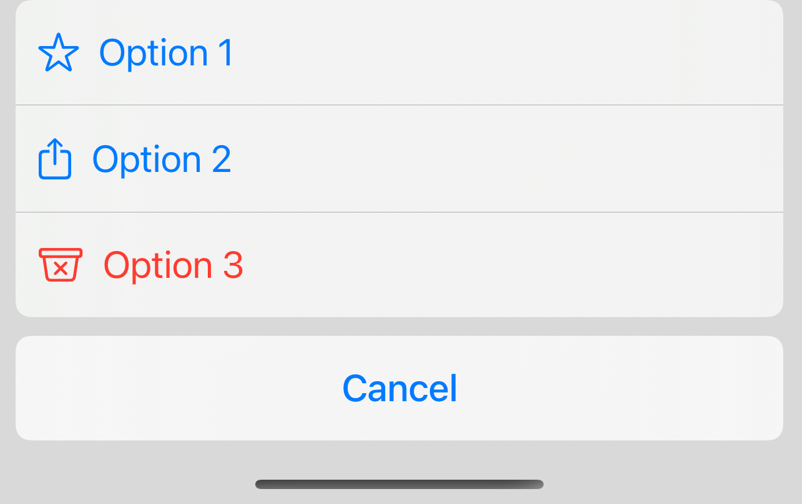

Custom `confirmationDialog` that allows icons and labels in buttons. Ordinarily any image is stripped out of your button, when using the system `confirmationDialog`, however this distinctive look is possible using this small library.

- Looks identical to the system `confirmationDialog`.
- Allows `Label`, `Image` or any arbitrary view to be used as the `Button` label.


### Installation

JEConfirmationDialogWithIconButtons is available via the [Swift Package Manager](https://developer.apple.com/documentation/swift_packages/adding_package_dependencies_to_your_app). Requires iOS 16.

```
https://github.com/jameseunson/JEConfirmationDialogWithIconButtons
```

### Usage

```swift
import SwiftUI
import DialogWithIconButtons

struct ContentView: View {
    @State var isSheetVisible = false
    var body: some View {
        Button("Show Sheet") {
            isSheetVisible = true
        }
    }
    .confirmationDialogWithIconButtons("Test Sheet", isPresented: $isSheetVisible, titleVisibility: .visible) {
        DialogIconButton {
            print("test")
        } label: {
            Label("Option 1", systemImage: "star")
        }

        DialogIconButton {
            print("test")
        } label: {
            Label("Option 2", systemImage: "square.and.arrow.up")
        }

        DialogIconButton(action: {
            print("test")
        }, label: {
            Label("Option 3", systemImage: "xmark.bin")
        },
        role: .destructive)

        DialogIconButton("Cancel", role: .cancel) {
            isTitleSheetVisible = false
        }
    }
}
```




### Examples

Check out the [example app](https://github.com/aheze/SwipeActions/archive/refs/heads/main.zip) for all examples and advanced usage!


### License

```
MIT License

Copyright (c) 2023 James Eunson

Permission is hereby granted, free of charge, to any person obtaining a copy
of this software and associated documentation files (the "Software"), to deal
in the Software without restriction, including without limitation the rights
to use, copy, modify, merge, publish, distribute, sublicense, and/or sell
copies of the Software, and to permit persons to whom the Software is
furnished to do so, subject to the following conditions:

The above copyright notice and this permission notice shall be included in all
copies or substantial portions of the Software.

THE SOFTWARE IS PROVIDED "AS IS", WITHOUT WARRANTY OF ANY KIND, EXPRESS OR
IMPLIED, INCLUDING BUT NOT LIMITED TO THE WARRANTIES OF MERCHANTABILITY,
FITNESS FOR A PARTICULAR PURPOSE AND NONINFRINGEMENT. IN NO EVENT SHALL THE
AUTHORS OR COPYRIGHT HOLDERS BE LIABLE FOR ANY CLAIM, DAMAGES OR OTHER
LIABILITY, WHETHER IN AN ACTION OF CONTRACT, TORT OR OTHERWISE, ARISING FROM,
OUT OF OR IN CONNECTION WITH THE SOFTWARE OR THE USE OR OTHER DEALINGS IN THE
SOFTWARE.
```
